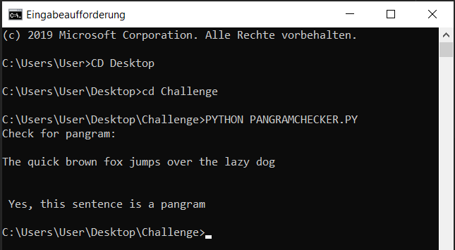
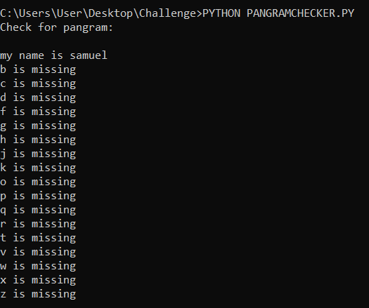
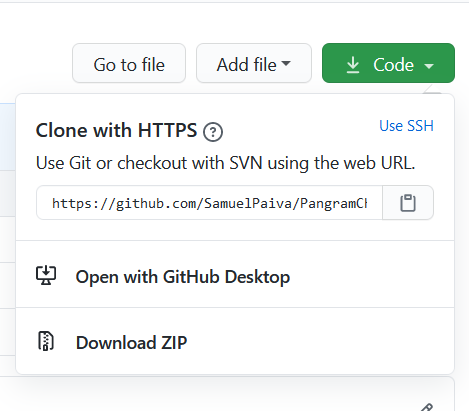
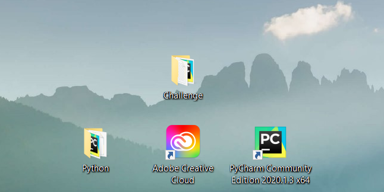
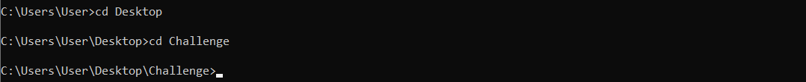
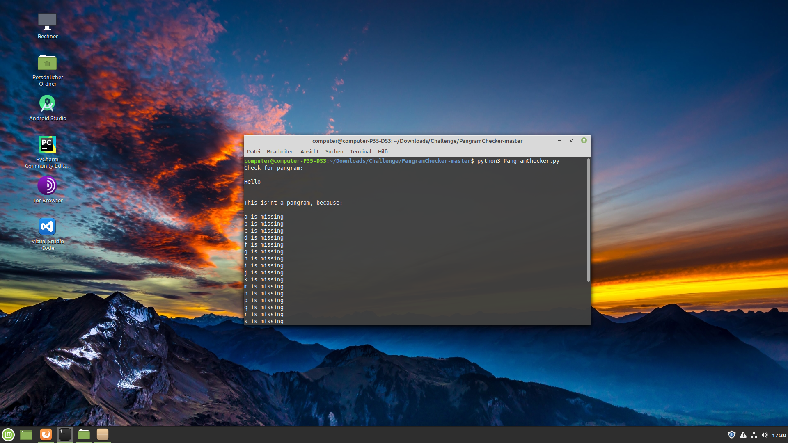

# PangramChecker

This is a program written in Python to check if a sentence is a pangram or not.
In case the sentence contains all the letters of the alphabet, the program tells you that it is an pangram.
If the sentence does not contain all the letters of the alphabet, the program tells you so and displays all the missing letters.

Just like this:

or this:

## Installation

#### Requirements

This is a really simple program so it should work fine on every operating system.
The program was tested on Windows and Linux.

To use the program on your Windows os follow these steps:

1. Download and extract the zipfile using this button:

2. Save the file in any folder you like, but make sure you know where. 
As you can see in the first two pictures, I've saved my files in a folder called "Challenge", which is located on my Desktop, so it's easy for me to run the file using the commandprompt, which I'll explain in the next step.

3. Open your commandpromt and use the "cd" comand to navigate to your folder. 
Since my directory is located on my desktop, I have to type in these two comands:

Now I'm in the folder where the PangramChecker.py is stored.

4. Lets run it using "PYTHON PANGRAMCHECKER.PY". 
This should start the program. A sentence will appear, which says "Check for Pangram".
Make sure you typed in everything right, of course you can copy and paste the comand.

5. You are ready to go.

#### For Linux 

For Linux it's even more simple.

1.After extraction just click the folder where the program is stored and select "open in terminal". This will save us the comands we typed in the commandprompt of Windows.

2. Now instead of typing "PYTHON PANGRAMCHECKER.PY", just type "python3 PangramChecker.py".

3. The program should be running now.

## Support and questions

For support and questions feel free to contact me by e-mail.
Send your e-mail to: samupaiva17@gmail.com
